# RVM in motion

Follow an agent through RVM: from machine entry and coherence domains to capability checks, memory, verified RVF packages, governed context, and recovery.

[← Repository overview](../README.md) · [Quick start](../userguide/01-quickstart.md)

[](assets/visuals/walkthrough.svg)

**12 chapters · 96 seconds · loops automatically.** Open any chapter below to study one flow. With reduced motion enabled, the tour holds its opening scene; the individual chapters remain available.

These diagrams explain architecture and documented workflows. Moving particles illustrate control or data flow; they are not live telemetry, timing measurements, or benchmark results.

| Chapter | What it explains |
|---|---|
| [01. An agent-native stack](#architecture) | Machine entry, the core, coherence, adapters, and persistent state. |
| [02. Bring the kernel online](#boot) | The seven phases in the kernel initialization sequence. |
| [03. Let the graph shape isolation](#coherence) | Agent communication feeds the optional coherence control loop. |
| [04. Authority before mutation](#security) | A request passes the security gate before its state transition. |
| [05. Schedule with two signals](#scheduling) | The scheduler combines time urgency with graph-derived pressure. |
| [06. Keep state at the right tier](#memory) | Memory tiers, checkpoints, and witness-based reconstruction. |
| [07. Choose an execution boundary](#execution) | A verified workload uses the isolation its selected adapter supports. |
| [08. Verify, then execute](#rvf) | RVForge authors packages; RVM verifies, maps, places, and launches them. |
| [09. Reconstruct the evidence](#witness) | A witness chain connects privileged operations and recovery checkpoints. |
| [10. A name is not permission](#context) | An out-of-band capability governs access to immutable context revisions. |
| [11. Anchor external evidence](#receipts) | External evaluation receipt commitments can enter the RVM witness chain. |
| [12. Build your first RVM](#quickstart) | Check and test the Rust workspace, then follow the platform build guide. |

<a id="architecture"></a>

## 01. An agent-native stack


RVM separates machine entry, its Rust `no_std` core, an optional coherence engine, execution adapters, and persistent state. Partitions are the units of isolation and scheduling. Capabilities carry authority; witnesses record privileged transitions. The coherence engine can be disabled without removing the core.

Read more: [Architecture](../userguide/03-architecture.md) · [Crate map](../README.md#crate-structure).

<a id="boot"></a>

## 02. Bring the kernel online


The ADR-137 boot sequence advances through reset, hardware detection, MMU setup, hypervisor mode, kernel object initialization, the first witness, and scheduler entry. Each completed phase records a witness before advancing. The diagram follows the current BootStage implementation and is an architectural walkthrough, not a captured boot session.

Read more: [BootStage implementation](../crates/rvm-boot/src/sequence.rs) · [Build and QEMU quick start](../userguide/01-quickstart.md).

<a id="coherence"></a>

## 03. Let the graph shape isolation


Communication edges form a weighted graph. The optional coherence engine tracks locality and cut pressure, and supports partition restructuring through split, merge, and migration. Animated node clusters illustrate changing relationships; no latency or optimality guarantee is implied by the motion.

Read more: [Partitions and scheduling](../userguide/07-partitions-scheduling.md) · [Coherence crate](../crates/rvm-coherence/).

<a id="security"></a>

## 04. Authority before mutation


RVM checks capability authority and verifies the required proof before a permitted state transition. Its security path emits witness records for decisions, including refusals. Proof requirements vary by operation and tier; this diagram does not imply that every path uses a zero-knowledge proof.

Read more: [Capabilities and proofs](../userguide/05-capabilities-proofs.md) · [Security gate](../crates/rvm-security/).

<a id="scheduling"></a>

## 05. Schedule with two signals


RVM scheduling uses deadline urgency and cut pressure. The first represents time-sensitive work; the second represents pressure from the coherence graph. This view explains the two inputs without prescribing weights. Animation speed is illustrative.

Read more: [Scheduling model](../userguide/07-partitions-scheduling.md) · [Scheduler crate](../crates/rvm-sched/).

<a id="memory"></a>

## 06. Keep state at the right tier


Memory regions have ownership and a tier: Hot, Warm, Dormant, or Cold. Dormant state can combine a checkpoint with a compressed witness trail for reconstruction. Tier transitions and recovery depend on the configured runtime and storage path; the drawing is a conceptual lifecycle.

Read more: [Memory model](../userguide/08-memory-model.md) · [Reconstruction design](adr/ADR-136-memory-hierarchy-reconstruction.md).

<a id="execution"></a>

## 07. Choose an execution boundary


The hosted path uses `rvm-host` to select available OS isolation and launch supported workloads, including WASM. Bare-metal partitions use the kernel target and its hardware mechanisms. Hosted WASM or an OS sandbox must not be described as bare-metal partition isolation. Optional GPU access is separately feature- and capability-gated.

Read more: [Host adapters](../crates/rvm-host/) · [WASM agents](../userguide/09-wasm-agents.md) · [GPU design](adr/ADR-144-gpu-compute-support.md).

<a id="rvf"></a>

## 08. Verify, then execute


RVForge authors and signs an RVF. `rvm-rvf` verifies its manifest and segments, maps capability requirements, and preserves package identity. `rvm-host` selects isolation and placement; `rvm-launch` manages the instance lifecycle. Inspect and verify do not execute the package. Unsupported capability requests are refused and witnessed.

Read more: [Execution contract](adr/ADR-155-rvf-execution-contract.md) · [Integration map](RVFORGE-INTEGRATION.md).

<a id="witness"></a>

## 09. Reconstruct the evidence


Witness records form an append-only, hash-chained audit trail. Checkpoint and replay mechanisms support recovery and forensic reconstruction of recorded transitions. The trace is illustrative: it contains no real workload, secrets, timestamps, or fabricated test results.

Read more: [Witness and audit](../userguide/06-witness-audit.md) · [Memory reconstruction](../userguide/08-memory-model.md).

<a id="context"></a>

## 10. A name is not permission


A `ruv://` URI is an inert name. Live capabilities arrive out of band; authorization and witnessing precede resolution or retrieval. RVF revisions are immutable, aliases update through compare-and-swap, and reads carry epoch receipts. Reading a skill does not execute it: execution requires a pinned URI and a separate permit.

Read more: [Governed context guide](../userguide/16-ruv-context.md) · [Namespace contract](adr/ADR-157-ruv-context-namespace.md) · [Hosted service](adr/ADR-158-ruv-context-hosted-service.md).

<a id="receipts"></a>

## 11. Anchor external evidence


`rvm-anchor` verifies external evaluation receipts and anchors their commitments into the witness chain. An anchor preserves a verifiable relationship to supplied evidence; it does not independently prove that an external evaluator or its conclusion is correct.

Read more: [Receipt anchoring](adr/ADR-156-external-receipt-anchoring.md) · [Anchor crate](../crates/rvm-anchor/).

<a id="quickstart"></a>

## 12. Build your first RVM


Clone with submodules because RVM consumes RuVector components. Run the host workspace checks first. The quick-start guide lists the AArch64 toolchain, QEMU, and binary conversion tools needed for the bare-metal build and run steps.

```bash
git clone --recurse-submodules https://github.com/ruvnet/rvm.git
cd rvm
cargo check
cargo test --workspace --lib
```

Read more: [Quick start](../userguide/01-quickstart.md) · [User guide](../userguide/) · [Releases](https://github.com/ruvnet/rvm/releases).

## Start with RVM

[Build RVM](../userguide/01-quickstart.md) · [Explore the API and concepts](../userguide/) · [Read the design decisions](adr/) · [View releases](https://github.com/ruvnet/rvm/releases)

## About the animations

Self-contained SVGs with native vector motion, no scripts, remote images, or external fonts. The layout uses a compact 16:9 canvas; all important content also appears as selectable text. The visual language follows RuVector: a near-black field, pale cyan geometry, mint signals, and orange trajectories. Geometric projections are visual metaphors, not claims about the underlying implementation.

The source storyboard and regeneration instructions are in [visuals/README.md](visuals/README.md).
